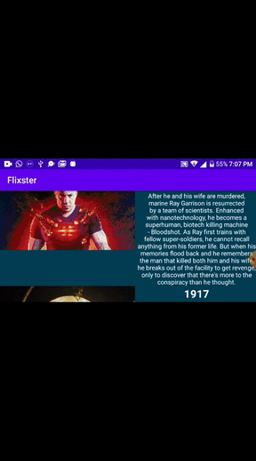

# Flixster App Part 1
Flixster is an application that allows users to browse movies from the [The Movie Database API](http://docs.themoviedb.apiary.io/#)

### User Stories

#### REQUIRED (10pts)
- [X] (10pts) User can view a list of movies (title, poster image, and overview) currently playing in theaters from the Movie Database API.

#### BONUS
- [X] (2pts) Views should be responsive for both landscape/portrait mode.
   - [X] (1pt) In portrait mode, the poster image, title, and movie overview is shown.
   - [X] (1pt) In landscape mode, the rotated alternate layout should use the backdrop image instead and show the title and movie overview to the right of it.

- [ ] (2pts) Display a nice default [placeholder graphic](https://guides.codepath.org/android/Displaying-Images-with-the-Glide-Library#advanced-usage) for each image during loading
- [X] (2pts) Improved the user interface by experimenting with styling and coloring.
- [ ] (2pts) For popular movies (i.e. a movie voted for more than 5 stars), the full backdrop image is displayed. Otherwise, a poster image, the movie title, and overview is listed. Use Heterogenous RecyclerViews and use different ViewHolder layout files for popular movies and less popular ones.

### App Walkthough GIF

### App Walkthough GIF Portrait Mode
 

### App Walkthough GIF Landscape Mode
 

### Notes
The challenge was to display the default place holder...

### Open-source libraries used

- [Android Async HTTP](https://github.com/codepath/CPAsyncHttpClient) - Simple asynchronous HTTP requests with JSON parsing
- [Glide](https://github.com/bumptech/glide) - Image loading and caching library for Androids
